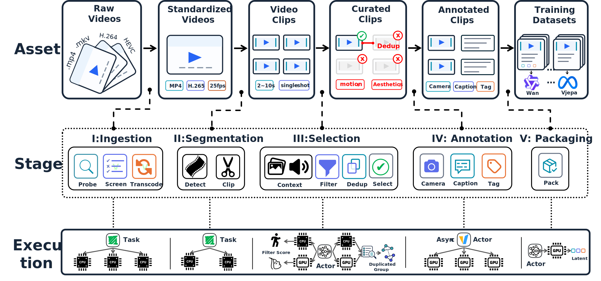

<p align="center">
  
</p>

<h1 align="center">
  
  VidaForge: Building a Video Foundation Model Pretraining Data Pipeline from Scratch in an Academic Lab
</h1>


<p align="center">
  <a href="https://yanmaaaaaa.notion.site/vidaforge">Blog</a>
  ·
  <a href="#quick-start">Quick Start</a>
  ·
  <a href="#citation">Citation</a>
</p>

VidaForge is a research-oriented data pipeline for video foundation model pretraining. It turns raw videos into standardized videos, scene-level clips, curated clips, annotated clips, and training-ready datasets for concrete training repositories.

The project started from a simple frustration: public video foundation model reports often spend less and less space on data processing, even as model quality keeps improving. The data work did not suddenly become trivial. More likely, the most valuable details moved into internal systems.

VidaForge is an attempt to make that part concrete in an academic lab. A data recipe should be easy to change. Intermediate assets should be easy to open and inspect. Rejected samples should stay available for analysis. Most importantly, a data decision should eventually be tested in real pretraining runs, not only in a spreadsheet.

Read the full project story here: https://yanmaaaaaa.notion.site/vidaforge

## Why VidaForge

Video data work is easy to describe vaguely and hard to study carefully. Raw videos come with mixed formats, broken files, variable frame rates, long takes, watermarks, repeated content, low-motion clips, and missing metadata. Once the raw pool gets large, every design choice becomes expensive: when to transcode, when to cut clips, how to keep rejected samples, how to compare selection recipes, and what exact format the training code will read.

VidaForge keeps the pipeline organized around data states:

```text
raw videos
  -> standardized videos
  -> video clips
  -> curated clips
  -> annotated clips
  -> training datasets
```

This is the main design bias of the project. Each stage leaves something concrete on disk, and the final output has to enter an actual video foundation model training loop.

<p align="center">
  
</p>

<p align="center">
  <em>VidaForge organizes the pipeline as data states, stage/step units, and execution patterns.</em>
</p>

## What VidaForge Does

VidaForge follows a five-stage pipeline:

1. **Ingestion**: probe raw videos, screen invalid inputs, and transcode videos into a standardized H.265/MP4 format.
2. **Segmentation**: detect scene boundaries and cut videos into 2-10 second clips.
3. **Selection**: extract context frames/audio, score quality signals, run hash-based and semantic deduplication, and write selection decisions.
4. **Annotation**: generate camera motion labels, multi-level captions, and structured semantic tags with VLM services.
5. **Packaging**: convert processed clips and metadata into dataset formats consumed by specific video pretraining codebases.

The pipeline stores media assets under `data/` and structured records under `meta/`. Metadata is written as Parquet shards so each stage can be resumed, inspected, and compared across data recipes.

## Repository Layout

```text
vidaforge/                  # reusable library code
recipe/                     # Hydra entrypoints for each stage
configs/                    # stage and step configs
scripts/                    # shell runners for common stage/step runs
README.md
pyproject.toml
```

The main entrypoints are:

```text
recipe/stage1_ingestion.py
recipe/stage2_segmentation.py
recipe/stage3_selection.py
recipe/stage4_annotation.py
recipe/stage5_packaging.py
```

## Installation

VidaForge uses separate environments for the data pipeline and downstream training code. Start with the VidaForge core environment first. This environment is enough for repository imports, stage runners, metadata processing, and FFmpeg-based media work.

VidaForge currently targets Linux x86_64 with Python 3.11.

```bash
git clone https://github.com/GAIR-NLP/VidaForge.git
cd VidaForge

uv venv .venv --python 3.11
source .venv/bin/activate
uv sync --prerelease=allow
```

Install FFmpeg separately. I usually use the prebuilt binaries from [BtbN/FFmpeg-Builds](https://github.com/BtbN/FFmpeg-Builds), such as the 7.1 or 8.1 builds. After downloading and unpacking the archive, the `bin/` directory should contain `ffmpeg` and `ffprobe`.

```bash
# Example after unpacking a downloaded FFmpeg build.
export PATH=/path/to/ffmpeg-build/bin:$PATH

# Check that both binaries are visible.
ffmpeg -version
ffprobe -version
```

Run a quick import check:

```bash
python - <<'PY'
import vidaforge
print("VidaForge import ok")
PY
```

## Data Directories

Most scripts use two paths:

```bash
RAW_DIR=/path/to/raw_videos
DATA_DIR=/path/to/vidaforge_output
```

`RAW_DIR` contains the original videos or raw video shards. `DATA_DIR` stores VidaForge outputs:

```text
DATA_DIR/
├─ data/     # video clips, frames, audio, tensor caches
└─ meta/     # Parquet metadata and summary.json files
```

## Quick Start

### 1. Prepare Example Data

<details>
<summary></summary>

The experiments in the blog used videos from [LLaVA-OneVision-2-Data](https://huggingface.co/datasets/mvp-lab/LLaVA-OneVision-2-Data). The full dataset is very large, so for a local smoke run you should start with a single tar shard, or simply use a few local videos.

Download and extract one example shard, then set the run paths:

```bash
mkdir -p examples/raw_videos

wget -c \
  "https://huggingface.co/datasets/mvp-lab/LLaVA-OneVision-2-Data/resolve/main/mid_training_video/60s/train_00000_of_10809.tar?download=true" \
  -O examples/train_00000_of_10809.tar

tar -xf examples/train_00000_of_10809.tar \
  -C examples/raw_videos

export RAW_DIR="$(pwd)/examples/raw_videos"
export DATA_DIR="$(pwd)/examples/vidaforge_output"
export RUN_ID=llava_ov2_60s_smoke
```

If you only want to test the pipeline mechanics, you can also skip the Hugging Face download and put a few `.mp4`, `.mkv`, `.mov`, or `.webm` files directly under `RAW_DIR`.

</details>

### 2. Run Stage 1 / Step 1: Probe

<details>
<summary></summary>

The first step is `probe`. It scans `RAW_DIR`, creates the first video records, and reads basic media information with `ffprobe`. This step does not transcode videos or create clips yet.

Probe uses the step config at:

```text
configs/stage1_ingestion/step/step1_probe.yaml
```

The main fields are:

- `step.ffprobe_bin`: path or command name for `ffprobe`.
- `step.batch_size`: how many raw-video records one Ray task handles at a time.
- `step.ray_num_cpus`: CPU resources requested by each Ray task.
- `step.temp_dir`: optional temporary directory used when probing videos inside `.tar` shards.
- `limit`: maximum number of raw videos to scan in this run.

The quick-start script uses `run_probe()` in `scripts/run_pipeline_example.sh` to call the step runner:

```bash
run_probe() {
  print_step "stage1_ingestion/step1_probe"
  bash scripts/stage1_ingestion/run_step1_probe.sh \
    limit="${VIDEO_LIMIT}" \
    step.batch_size=128 \
    step.ffprobe_bin="ffprobe"
}
```

The command after `scripts/stage1_ingestion/run_step1_probe.sh` sets the concrete values for this smoke run. In the example above, it scans at most `VIDEO_LIMIT` raw videos, uses `batch_size=128`, and calls `ffprobe` from `PATH`. If you downloaded an FFmpeg build without adding it to `PATH`, replace `step.ffprobe_bin="ffprobe"` with the absolute path to that binary, such as `/path/to/ffmpeg-build/bin/ffprobe`.

If you are running locally, start a Ray runtime first:

```bash
ray start --head --num-cpus 8
```

```bash
bash scripts/run_pipeline_example.sh probe
```

Probe writes metadata here:

```text
DATA_DIR/meta/stage1_ingestion/step1_probe/run_id_${RUN_ID}/
```

Check the `summary.json` in that directory first. A small successful run should have non-zero `source_count`, `output_count`, and `ok_count`.

</details>

### 3. Run Stage 1 / Step 2: Screen

<details>
<summary></summary>

`screen` reads the Probe metadata and applies cheap rules before any heavy video processing. It is metadata-only: it checks whether each raw video was probed successfully, whether the resolution and fps are usable, and whether the duration is within the expected range.

Screen uses the step config at:

```text
configs/stage1_ingestion/step/step2_screen.yaml
```

The core of this step is the rule block:

```yaml
rules:
  probe:
    field: probe_ok
    equals: 1
    reject_reason: probe_failed

  short_side:
    field: short_side
    min: 360
    reject_reason: resolution_too_low

  fps:
    field: fps
    min: 20.0
    reject_reason: fps_too_low

  duration:
    field: duration_sec
    min: 1.0
    max: 600.0
    min_reject_reason: duration_too_short
    max_reject_reason: duration_too_long
```

Each rule reads one field from the Probe row. Screen writes all rows to the root output directory, then writes passed rows to `pass/` and rejected rows to `reject/`. Rejected rows carry `screen_reject_reason`, such as `probe_failed`, `resolution_too_low`, `fps_too_low`, `duration_too_short`, or `duration_too_long`. `limit` is still useful for smoke runs: it caps how many probed video records are screened.

The quick-start script uses `run_screen()` in `scripts/run_pipeline_example.sh` to call the step runner:

```bash
run_screen() {
  print_step "stage1_ingestion/step2_screen"
  bash scripts/stage1_ingestion/run_step2_screen.sh \
    step.rules.short_side.min=256 \
    limit="${VIDEO_LIMIT}"
}
```

The default config uses `short_side >= 360`. The quick-start runner lowers it to `256` so a small local smoke run can keep more examples. If you want stricter input quality, edit `step.rules.short_side.min`, `step.rules.fps.min`, or the duration thresholds in this function.

```bash
bash scripts/run_pipeline_example.sh screen
```

Screen reads Probe metadata from:

```text
DATA_DIR/meta/stage1_ingestion/step1_probe/run_id_${INPUT_RUN_ID}/
```

It writes Screen metadata here:

```text
DATA_DIR/meta/stage1_ingestion/step2_screen/run_id_${RUN_ID}/
```

The root output directory keeps all rows with `screen_ok`, `screen_pass`, `screen_reject_reason`, and `screen_json`. Passed rows are also written under `pass/`, and rejected rows are written under `reject/`:

```text
DATA_DIR/meta/stage1_ingestion/step2_screen/run_id_${RUN_ID}/pass/
DATA_DIR/meta/stage1_ingestion/step2_screen/run_id_${RUN_ID}/reject/
```

Check `summary.json` first. A useful local run should have `output_count` equal to the number of screened rows, plus non-negative `pass_count` and `reject_count`. `reject_reason_counts` shows which rule rejected each failed video.

</details>

### 4. Run Stage 1 / Step 3: Transcode

<details>
<summary></summary>

`transcode` reads the Screen-processed video records and writes standardized MP4 videos. This is the first Stage 1 step that creates new video files under `DATA_DIR/data/`.

This step uses FFmpeg and ffprobe. The FFmpeg build should provide `ffmpeg`, `ffprobe`, `libx265`, and AAC encoding.

Transcode uses the step config at:

```text
configs/stage1_ingestion/step/step3_transcode.yaml
```

The main fields are:

- `step.target_short_edge`: downsample high-resolution videos so the short side is at most this value; low-resolution videos are not upscaled.
- `step.target_fps`: output fps.
- `step.crf`: x265 quality setting; lower values create larger, higher-quality files.
- `step.pix_fmt`: output pixel format; `yuv420p` is the compatibility default.
- `step.audio_bitrate`: output AAC audio bitrate.
- `step.ray_num_cpus`: CPU resources requested by each Ray task.
- `step.ffmpeg_threads`: FFmpeg threads used inside each task.
- `step.ffmpeg_bin` and `step.ffprobe_bin`: path or command name for `ffmpeg` and `ffprobe`.
- `step.resume`: skip already successful outputs when re-running the same `RUN_ID`.
- `limit`: maximum number of video records to transcode in this run.

The quick-start script uses `run_transcode()` in `scripts/run_pipeline_example.sh` to call the step runner:

```bash
run_transcode() {
  print_step "stage1_ingestion/step3_transcode"
  bash scripts/stage1_ingestion/run_step3_transcode.sh \
    limit="${VIDEO_LIMIT}" \
    step.ffmpeg_bin="ffmpeg" \
    step.ffprobe_bin="ffprobe" \
    step.ray_num_cpus=1 \
    step.ffmpeg_threads=1
}
```

By default, the step runner reads the root Screen output, which contains all rows. For a local smoke run, the example runner keeps CPU usage conservative with one Ray CPU and one FFmpeg thread per task. If your FFmpeg build is not in `PATH`, replace `step.ffmpeg_bin="ffmpeg"` and `step.ffprobe_bin="ffprobe"` with absolute paths.

If you only want to transcode Screen-passed rows, add an `input_path` override in `run_transcode()`:

```bash
input_path="${DATA_DIR}/meta/stage1_ingestion/step2_screen/run_id_${INPUT_RUN_ID}/pass"
```

```bash
bash scripts/run_pipeline_example.sh transcode
```

Transcode reads Screen metadata from:

```text
DATA_DIR/meta/stage1_ingestion/step2_screen/run_id_${INPUT_RUN_ID}/
```

It writes standardized videos under:

```text
DATA_DIR/data/stage1_ingestion/step3_transcode/run_id_${RUN_ID}/
```

Video files are bucketed by `video_id`, so the output directory will contain nested hash folders rather than one flat folder.

It writes Transcode metadata here:

```text
DATA_DIR/meta/stage1_ingestion/step3_transcode/run_id_${RUN_ID}/
```

Each output row keeps the upstream fields and adds `video_path`, refreshed media metadata from `ffprobe`, `filesize_bytes`, `transcode_ok`, `transcode_error`, `transcode_mode`, and `transcode_elapsed_sec`.

Check `summary.json` first. A useful local run should have `ok_count` close to `output_count`. If `failed_count` is non-zero, inspect `failed_examples` and the `transcode_error` field in the metadata.

</details>

### 5. Run Stage 2 / Step 1: Detect

<details>
<summary></summary>

`detect` reads standardized video records from Transcode and writes candidate cut points for each video. It does not cut video files yet. The output is still one row per video, with a `ticks_sec` field that stores the detected time boundaries in seconds.

Detect uses the step config at:

```text
configs/stage2_segmentation/step/step1_detect.yaml
```

The default config uses `adaptive` detection:

```yaml
detectors: [adaptive]
min_len_sec: 1.0
ray_num_cpus: 1.0
resume: false
```

The quick-start script currently uses TransNetV2 instead. Download `transnetv2-pytorch-weights.pth` from [Sn4kehead/TransNetV2](https://huggingface.co/Sn4kehead/TransNetV2), then replace the placeholder `weights_path` in `run_detect()`:

```bash
run_detect() {
  print_step "stage2_segmentation/step1_detect"
  bash scripts/stage2_segmentation/run_step1_detect.sh \
    limit="${VIDEO_LIMIT}" \
    step.ray_num_cpus=1 \
    step.min_len_sec=2.0 \
    step.detectors=['transnetv2'] \
    step.detector.transnetv2.weights_path="/path/to/transnetv2-pytorch-weights.pth"
}
```

The main fields are:

- `step.detectors`: detector names to run, such as `adaptive` or `transnetv2`.
- `step.min_len_sec`: minimum segment length used by the detector.
- `step.ray_num_cpus`: CPU resources requested by each Ray task.
- `step.detector.transnetv2.weights_path`: local path to the TransNetV2 weight file when using `transnetv2`.
- `step.resume`: skip already successful rows when re-running the same `RUN_ID`.
- `limit`: maximum number of video records to detect in this run.

```bash
bash scripts/run_pipeline_example.sh detect
```

Detect reads Transcode metadata from:

```text
DATA_DIR/meta/stage1_ingestion/step3_transcode/run_id_${INPUT_RUN_ID}/
```

It writes Detect metadata here:

```text
DATA_DIR/meta/stage2_segmentation/step1_detect/run_id_${RUN_ID}/
```

Each output row keeps the upstream fields and adds `ticks_sec`, `detectors`, `detect_ok`, and `detect_error`.

Check `summary.json` first. A useful local run should have `ok_count` close to `output_count`. If `failed_count` is non-zero, inspect `failed_examples` and the `detect_error` field in the metadata. If the error says the TransNetV2 weights file is missing, update `step.detector.transnetv2.weights_path` in `run_detect()`.

</details>

### 6. Run Stage 2 / Step 2: Clip

<details>
<summary></summary>

`clip` reads Detect metadata, turns `ticks_sec` into final clip time ranges, and cuts MP4 clip files with FFmpeg. This step changes the unit of the dataset: the input is one row per video, and the output is one row per clip.

Clip uses the step config at:

```text
configs/stage2_segmentation/step/step2_clip.yaml
```

The main fields are:

- `step.min_len_sec`: discard final clips shorter than this value.
- `step.max_len_sec`: keep detected ranges up to this length.
- `step.overlong_split_len_sec`: if a detected range is longer than `step.max_len_sec`, split it into chunks with this target length.
- `step.boundary_trim_sec`: trim a small margin near detected boundaries. This helps when a scene boundary is a soft transition and the visual change takes a short time to finish.
- `step.ray_num_cpus`: CPU resources requested by each Ray task.
- `step.ffmpeg_bin`: path or command name for `ffmpeg`.
- `step.resume`: skip already successful outputs when re-running the same `RUN_ID`.
- `limit`: maximum number of detected video records to process in this run.

The quick-start script uses `run_clip()` in `scripts/run_pipeline_example.sh` to call the step runner:

```bash
run_clip() {
  print_step "stage2_segmentation/step2_clip"
  bash scripts/stage2_segmentation/run_step2_clip.sh \
    limit="${VIDEO_LIMIT}" \
    step.ffmpeg_bin="ffmpeg" \
    step.ray_num_cpus=2 \
    step.min_len_sec=2.0
}
```

The quick-start runner uses CPU FFmpeg clipping. If your FFmpeg build is not in `PATH`, replace `step.ffmpeg_bin="ffmpeg"` with the absolute path to the binary.

```bash
bash scripts/run_pipeline_example.sh clip
```

Clip reads Detect metadata from:

```text
DATA_DIR/meta/stage2_segmentation/step1_detect/run_id_${INPUT_RUN_ID}/
```

It writes clip videos under:

```text
DATA_DIR/data/stage2_segmentation/step2_clip/run_id_${RUN_ID}/
```

Clip files are bucketed by `clip_id`, so the output directory will contain nested hash folders rather than one flat folder.

It writes Clip metadata here:

```text
DATA_DIR/meta/stage2_segmentation/step2_clip/run_id_${RUN_ID}/
```

Each output row keeps the upstream fields and adds `clip_id`, `clip_path`, `start_sec`, `end_sec`, `duration_sec`, `detect_start_sec`, `detect_end_sec`, `detect_duration_sec`, `clip_index`, `split_index`, `ffmpeg_elapsed_sec`, `filesize_bytes`, `clip_ok`, and `clip_error`.

Check `summary.json` first. Here `input_count` counts detected video rows, while `output_count` counts produced clip rows. A useful local run should have non-zero `output_count` and `ok_count` close to `output_count`. If `failed_count` is non-zero, inspect `failed_examples` and the `clip_error` field in the metadata.

</details>

### 7. Run Stage 3 / Step 1: Context

<details>
<summary></summary>

`context` reads clip metadata and extracts lightweight context assets for each clip. It writes sampled frames and, when audio exists, an audio snippet. Later filter, annotation, and viewer steps can reuse these assets without decoding the original clip again.

Context uses the step config at:

```text
configs/stage3_selection/step/step1_context.yaml
```

The main fields are:

- `step.frame.sampled_fps`: frame sampling rate.
- `step.frame.short_side`: short side of extracted frames.
- `step.frame.jpeg_qscale`: JPEG quality scale for extracted frames; lower values create higher-quality images.
- `step.audio.format`: output audio format, currently `m4a` or `wav`.
- `step.audio.sample_rate`: output audio sample rate.
- `step.audio.channels`: output audio channels.
- `step.batch_size`: how many clip rows one Ray task handles at a time.
- `step.ray_num_cpus`: CPU resources requested by each Ray task.
- `step.ffmpeg_bin`: path or command name for `ffmpeg`.
- `step.resume`: skip already successful outputs when re-running the same `RUN_ID`.
- `limit`: maximum number of clip records to process in this run.

The quick-start script uses `run_context()` in `scripts/run_pipeline_example.sh` to call the step runner:

```bash
run_context() {
  print_step "stage3_selection/step1_context"
  bash scripts/stage3_selection/run_step1_context.sh \
    limit="${CLIP_LIMIT}" \
    step.ray_num_cpus=1 \
    step.batch_size=4 \
    step.ffmpeg_bin="ffmpeg" \
    step.frame.sampled_fps=2 \
    step.frame.short_side=256
}
```

The quick-start runner samples frames at 2 fps and uses short side 256 for a lighter local run. If your FFmpeg build is not in `PATH`, replace `step.ffmpeg_bin="ffmpeg"` with the absolute path to the binary.

```bash
bash scripts/run_pipeline_example.sh context
```

Context reads Clip metadata from:

```text
DATA_DIR/meta/stage2_segmentation/step2_clip/run_id_${INPUT_RUN_ID}/
```

It writes extracted frames and audio under:

```text
DATA_DIR/data/stage3_selection/step1_context/run_id_${RUN_ID}/
```

Context assets are bucketed by `clip_id`, so the output directory will contain nested hash folders rather than one flat folder.

It writes Context metadata here:

```text
DATA_DIR/meta/stage3_selection/step1_context/run_id_${RUN_ID}/
```

Each output row keeps the upstream clip fields and adds `frame_json`, `audio_json`, `context_ok`, `context_error`, `frame_ok`, `frame_error`, `audio_ok`, and `audio_error`. `frame_json` records sampled frame paths and timestamps. `audio_json` records whether audio exists and where the extracted audio file was written.

Check `summary.json` first. A useful local run should have `output_count` equal to the number of processed clip rows, and `ok_count` close to `output_count`. If `failed_count` is non-zero, inspect `failed_examples`, `context_error`, and `frame_error` in the metadata.

</details>

### 8. Run Stage 3 / Step 2: Filter

<details>
<summary></summary>

`filter` reads Context metadata and writes quality signals for each clip. In the quick-start runner, this step is split into three passes because they use different resources:

1. optical + motion, which can run without model weights;
2. aesthetic, which uses a SigLIP encoder and an aesthetic predictor;
3. text, which uses an OCR text detector.

The shared step config is:

```text
configs/stage3_selection/step/step2_filter.yaml
```

The default config enables only `optical` and `motion`:

```yaml
filters:
  - optical
  - motion

batch_size: 128
replicas: auto
ray_num_cpus: 1.0
ray_num_gpus: 0.0
resume: false
```

Each filter appends its own score and diagnostic payload, such as `optical_score`, `motion_score`, `aesthetic_score`, or `text_score`. The score fields are normalized to the 0-1 range, and higher is better. The diagnostic payloads keep extra details for debugging and visualization. The step also maintains shared fields: `filters`, `filter_ok`, and `filter_error`. Downstream dedup and select steps read the final filter output from `step2_filter`.

#### 8.1 Optical + Motion

This pass reads Context metadata and writes the first filter output:

```text
DATA_DIR/meta/stage3_selection/step2_filter_quality/run_id_${RUN_ID}/
```

The quick-start script uses `run_filter_quality()` in `scripts/run_pipeline_example.sh`:

```bash
run_filter_quality() {
  local input_path="${DATA_DIR}/meta/stage3_selection/step1_context/run_id_${RUN_ID}"
  local output_path="${DATA_DIR}/meta/stage3_selection/step2_filter_quality/run_id_${RUN_ID}"

  print_step "stage3_selection/step2_filter_quality"
  bash scripts/stage3_selection/run_step2_filter.sh \
    input_path="${input_path}" \
    output_path="${output_path}" \
    limit="${CLIP_LIMIT}" \
    step.batch_size=32 \
    step.filters='[optical,motion]' \
    step.ray_num_gpus=0 \
    step.filter.motion.ffmpeg_bin="ffmpeg"
}
```

The main fields are:

- `step.filters='[optical,motion]'`: run the optical and motion filters in this pass.
- `step.batch_size`: how many clip rows one worker handles at a time.
- `step.ray_num_gpus=0`: this pass does not request GPU resources.
- `step.filter.motion.ffmpeg_bin`: path or command name for `ffmpeg`.
- `limit`: maximum number of clip records to filter in this run.

```bash
bash scripts/run_pipeline_example.sh filter_quality
```

Check `summary.json` first. A useful local run should have `output_count` equal to the number of processed clip rows, with `optical_score` and `motion_score` available in the output metadata.

#### 8.2 Aesthetic

This pass reads the optical + motion output and appends `aesthetic_score`.

Download the model assets first:

- `aesthetic_predictor_v2_5.pth` from [discus0434/aesthetic-predictor-v2-5](https://github.com/discus0434/aesthetic-predictor-v2-5/blob/main/models/aesthetic_predictor_v2_5.pth)
- `siglip-so400m-patch14-384` from [google/siglip-so400m-patch14-384](https://huggingface.co/google/siglip-so400m-patch14-384)

Place them like this:

```text
/path/to/aesthetic_models/
├─ aesthetic_predictor_v2_5.pth
└─ siglip-so400m-patch14-384/
```

The aesthetic filter config is:

```text
configs/stage3_selection/filter/aesthetic.yaml
```

The quick-start script uses `run_filter_aesthetic()`:

```bash
run_filter_aesthetic() {
  local input_path="${DATA_DIR}/meta/stage3_selection/step2_filter_quality/run_id_${RUN_ID}"
  local output_path="${DATA_DIR}/meta/stage3_selection/step2_filter_aesthetic/run_id_${RUN_ID}"

  print_step "stage3_selection/step2_filter_aesthetic"
  bash scripts/stage3_selection/run_step2_filter.sh \
    input_path="${input_path}" \
    output_path="${output_path}" \
    limit="${CLIP_LIMIT}" \
    step.batch_size=192 \
    step.filters='[aesthetic]' \
    step.ray_num_cpus=10 \
    step.ray_num_gpus=1 \
    step.filter.aesthetic.device=cuda \
    step.filter.aesthetic.forward_batch_size=512 \
    step.filter.aesthetic.prefetch_batches=2 \
    step.filter.aesthetic.predictor_path="/path/to/aesthetic_predictor_v2_5.pth" \
    step.filter.aesthetic.encoder_path="/path/to/siglip-so400m-patch14-384"
}
```

Replace the two placeholder paths with your local model paths:

- `step.filter.aesthetic.predictor_path`: local path to `aesthetic_predictor_v2_5.pth`.
- `step.filter.aesthetic.encoder_path`: local path to the SigLIP model directory.

This pass requests one GPU per worker in the example runner. If your local Ray runtime was started without GPU resources, connect to a GPU-capable Ray runtime before running this pass.

```bash
bash scripts/run_pipeline_example.sh filter_aesthetic
```

It writes metadata here:

```text
DATA_DIR/meta/stage3_selection/step2_filter_aesthetic/run_id_${RUN_ID}/
```

Check `summary.json` first. A useful run should have `aesthetic_score`, `aesthetic_ok`, and `aesthetic_error` in the output metadata.

#### 8.3 Text

This pass reads the aesthetic output and appends OCR-based text contamination signals.

Download the text detector from [PaddlePaddle/PP-OCRv5_server_det_safetensors](https://huggingface.co/PaddlePaddle/PP-OCRv5_server_det_safetensors), then set `step.filter.text.model_path` to the local model directory.

The text filter config is:

```text
configs/stage3_selection/filter/text.yaml
```

The quick-start script uses `run_filter_text()`:

```bash
run_filter_text() {
  local input_path="${DATA_DIR}/meta/stage3_selection/step2_filter_aesthetic/run_id_${RUN_ID}"
  local output_path="${DATA_DIR}/meta/stage3_selection/step2_filter/run_id_${RUN_ID}"

  print_step "stage3_selection/step2_filter"
  bash scripts/stage3_selection/run_step2_filter.sh \
    input_path="${input_path}" \
    output_path="${output_path}" \
    limit="${CLIP_LIMIT}" \
    step.batch_size=192 \
    step.filters='[text]' \
    step.ray_num_cpus=10 \
    step.ray_num_gpus=1 \
    step.filter.text.device=cuda \
    step.filter.text.forward_batch_size=512 \
    step.filter.text.prefetch_batches=2 \
    step.filter.text.model_path="/path/to/PP-OCRv5_server_det_safetensors"
}
```

The main fields are:

- `step.filters='[text]'`: run only the text filter in this pass.
- `step.filter.text.model_path`: local path to `PP-OCRv5_server_det_safetensors`.
- `step.filter.text.device`: `cuda` in the example runner.
- `step.filter.text.text_min_confidence`: ignore OCR boxes below this confidence.
- `step.filter.text.text_ratio_quantile`: aggregate text area ratios across frames using this quantile.
- `step.ray_num_gpus=1`: request one GPU per worker in the example runner.

```bash
bash scripts/run_pipeline_example.sh filter_text
```

The final filter metadata is written here:

```text
DATA_DIR/meta/stage3_selection/step2_filter/run_id_${RUN_ID}/
```

This is the Filter output used by the following dedup and select steps. Check `summary.json` first, then inspect a few output rows for `optical_score`, `motion_score`, `aesthetic_score`, `text_score`, and `filter_ok`.

</details>

### 9. Run Stage 3 / Step 3: Dedup

<details>
<summary></summary>

`dedup` reads the final Filter metadata and writes duplicate-group fields for clips that passed filtering. It does not delete clips. It records which clips belong to the same duplicate group, then the later Select step decides how many clips to keep from each group.

The step currently uses two dedup methods:

1. PDQ for hash-based near-duplicate matching.
2. Cosmos-Embed for semantic duplicate matching.

There are two config layers:

- `configs/stage3_selection/step/step3_dedup.yaml` controls how dedup runs at scale. `apply` computes per-clip features, and `match` gathers those features to build duplicate pairs/groups.
- `configs/stage3_selection/dedup/pdq.yaml` and `configs/stage3_selection/dedup/cosmos.yaml` control what counts as a duplicate for each method.

Both layers use the word `match`, but they refer to different things. `step.match.*` is execution config: how many match actors to use, how many CPUs/GPUs they request, and how many feature rows they process per batch. `deduplicator.*.match.*` is dedup logic: PDQ Hamming distance, Cosmos cosine threshold, `top_k`, and FAISS backend.

The orchestrator only sends rows with `filter_ok == 1` into dedup, so `input_count` in `summary.json` can be smaller than the number of rows in the Filter output. The output metadata has one shared status layer (`dedup_ok`, `dedup_error`, `dedup_json`) and one group-info layer for each method. For example, `pdq_group_id` or `cosmos_group_id` identifies the duplicate group, `*_group_size` records group size, and `*_is_best_clip_in_group` marks the representative clip selected inside that group.

#### 9.1 PDQ Dedup

PDQ dedup reads the final Filter output and writes the first dedup output:

```text
DATA_DIR/meta/stage3_selection/step3_dedup_pdq/run_id_${RUN_ID}/
```

The PDQ config is:

```text
configs/stage3_selection/dedup/pdq.yaml
```

Its matching-related fields look like this:

```yaml
feature:
  min_quality: 50.0

match:
  hamming_distance_threshold: 31
  min_similar_frame_ratio: 0.8
  top_k: 50
  index_backend: faiss_cpu
```

The main fields are:

- `feature.min_quality`: ignore low-quality frame hashes.
- `match.hamming_distance_threshold`: maximum PDQ Hamming distance for candidate matches.
- `match.min_similar_frame_ratio`: minimum ratio of similar frames required to group two clips.
- `match.top_k`: number of nearest-neighbor candidates retrieved from the FAISS index before applying the PDQ thresholds.
- `match.index_backend`: PDQ currently uses `faiss_cpu`.

The quick-start script uses `run_dedup_pdq()` in `scripts/run_pipeline_example.sh`:

```bash
run_dedup_pdq() {
  local input_path="${DATA_DIR}/meta/stage3_selection/step2_filter/run_id_${RUN_ID}"
  local output_path="${DATA_DIR}/meta/stage3_selection/step3_dedup_pdq/run_id_${RUN_ID}"

  print_step "stage3_selection/step3_dedup_pdq"
  bash scripts/stage3_selection/run_step3_dedup.sh \
    input_path="${input_path}" \
    output_path="${output_path}" \
    limit="${CLIP_LIMIT}" \
    step.deduplicators='[pdq]' \
    step.apply.enabled=true \
    step.apply.replicas=auto \
    step.apply.ray_num_cpus=1 \
    step.apply.ray_num_gpus=0 \
    step.apply.batch_size=64 \
    step.match.replicas=auto \
    step.match.ray_num_cpus=16 \
    step.match.ray_num_gpus=0 \
    step.match.batch_size=512
}
```

```bash
bash scripts/run_pipeline_example.sh dedup_pdq
```

Check `summary.json` first:

- `input_count`: how many filtered clips entered PDQ dedup.
- `output_count`: how many clips were written back with PDQ metadata.
- `pair_count`: how many duplicate candidate pairs passed the PDQ matching rules.
- `deduplicator_match_summary`: PDQ-level match statistics, including group counts.
- `use_gpu_faiss`: whether FAISS matching used GPU resources in this run.

Then inspect a few output rows:

- `pdq_group_id`: duplicate group id. Empty means the clip was not grouped with another clip.
- `pdq_group_size`: number of clips in the group.
- `pdq_is_best_clip_in_group`: whether this clip is the representative clip selected inside the group.

#### 9.2 Cosmos-Embed Dedup

Cosmos-Embed dedup reads the PDQ output and writes the final dedup output:

```text
DATA_DIR/meta/stage3_selection/step3_dedup/run_id_${RUN_ID}/
```

Download the embedding model from [nvidia/Cosmos-Embed1-336p](https://huggingface.co/nvidia/Cosmos-Embed1-336p), then set `step.deduplicator.cosmos.feature.model_name` to the local model directory or the Hugging Face model name.

The Cosmos config is:

```text
configs/stage3_selection/dedup/cosmos.yaml
```

Its matching-related fields look like this:

```yaml
feature:
  model_name: nvidia/Cosmos-Embed1-336p
  forward_batch_size: 8
  frame_load_workers: ${step.apply.ray_num_cpus}
  prefetch_batches: 0

match:
  min_cosine_similarity: 0.95
  top_k: 50
  index_backend: gpu_cuvs
```

The main fields are:

- `feature.model_name`: local path or Hugging Face model name for Cosmos-Embed1-336p.
- `feature.forward_batch_size`: embedding batch size inside each apply worker.
- `feature.frame_load_workers`: workers used to load context frames.
- `feature.prefetch_batches`: how many batches to prepare ahead of the current GPU forward pass. Larger values can reduce GPU waiting time, but use more host memory. For a small local run, `0` is fine.
- `match.min_cosine_similarity`: minimum cosine similarity for semantic duplicate candidates.
- `match.top_k`: number of nearest-neighbor candidates retrieved from the FAISS index before applying the cosine-similarity threshold.
- `match.index_backend`: FAISS backend. The example uses `gpu_cuvs`, which uses NVIDIA cuVS through FAISS on GPU.

The current code includes a transformer compatibility patch for Cosmos, so Cosmos can run in the same main VidaForge environment with transformer v5.

The quick-start script uses `run_dedup_cosmos()`:

```bash
run_dedup_cosmos() {
  local input_path="${DATA_DIR}/meta/stage3_selection/step3_dedup_pdq/run_id_${RUN_ID}"
  local output_path="${DATA_DIR}/meta/stage3_selection/step3_dedup/run_id_${RUN_ID}"

  print_step "stage3_selection/step3_dedup_cosmos"
  bash scripts/stage3_selection/run_step3_dedup.sh \
    input_path="${input_path}" \
    output_path="${output_path}" \
    limit="${CLIP_LIMIT}" \
    step.deduplicators='[cosmos]' \
    step.apply.enabled=true \
    step.apply.replicas=auto \
    step.apply.ray_num_cpus=5 \
    step.apply.ray_num_gpus=1 \
    step.apply.batch_size=768 \
    step.match.replicas=auto \
    step.match.ray_num_cpus=16 \
    step.match.ray_num_gpus=1 \
    step.match.batch_size=512 \
    step.deduplicator.cosmos.feature.model_name="/path/to/Cosmos-Embed1-336p" \
    step.deduplicator.cosmos.feature.forward_batch_size=256 \
    step.deduplicator.cosmos.feature.prefetch_batches=2 \
    step.deduplicator.cosmos.match.min_cosine_similarity=0.95 \
    step.deduplicator.cosmos.match.index_backend=gpu_cuvs
}
```

Replace `/path/to/Cosmos-Embed1-336p` with your local model directory. This pass requests GPU resources for both feature extraction and matching. If your local Ray runtime was started without GPU resources, connect to a GPU-capable Ray runtime before running this pass.

```bash
bash scripts/run_pipeline_example.sh dedup_cosmos
```

The final dedup metadata is written here:

```text
DATA_DIR/meta/stage3_selection/step3_dedup/run_id_${RUN_ID}/
```

This is the Dedup output used by the Select step. Check `summary.json` first:

- `input_count`: how many filtered clips entered Cosmos dedup.
- `output_count`: how many clips were written back with Cosmos metadata.
- `pair_count`: how many duplicate candidate pairs passed the Cosmos cosine threshold.
- `deduplicator_match_summary`: Cosmos-level match statistics, including group counts.
- `use_gpu_faiss`: whether FAISS matching used GPU resources in this run.
- `match_faiss_num_threads`: CPU thread count used by FAISS when CPU matching is active.

Then inspect a few output rows:

- `cosmos_group_id`: semantic duplicate group id. Empty means the clip was not grouped with another clip.
- `cosmos_group_size`: number of clips in the group.
- `cosmos_is_best_clip_in_group`: whether this clip is the representative clip selected inside the group.
- inherited `pdq_*` fields: PDQ results from the previous dedup pass.

</details>

### 10. Run Stage 3 / Step 4: Select

<details>
<summary></summary>

`select` reads the final Dedup metadata and writes the selection decision for each clip. This step does not create new video files. It writes metadata that says whether a clip is selected for the current recipe, and why a rejected clip was rejected.

Select uses the step config at:

```text
configs/stage3_selection/step/step4_select.yaml
```

The config has two rule groups:

```yaml
filter:
  filter_ok:
    equals: 1
    reject_reason: filter_failed

  optical:
    min: 0.9
    reject_reason: low_optical

  motion:
    min: 0.2
    reject_reason: low_motion

  aesthetic:
    min: 0.55
    reject_reason: low_aesthetic

  text:
    min: 0.5
    reject_reason: high_text

dedup:
  dedup_ok:
    equals: 1
    reject_reason: dedup_failed

  pdq:
    keep_ratio: 1.0
    min_keep: 1
    max_keep: 1
    reject_reason: pdq_duplicate

  cosmos:
    keep_ratio: 0.2
    min_keep: 1
    max_keep: 20
    reject_reason: cosmos_duplicate
```

The filter rules read the normalized 0-1 scores from the Filter step. A clip must pass `filter_ok`, `optical`, `motion`, `aesthetic`, and `text` thresholds before duplicate-group selection is applied.

The dedup rules control how many clips are kept inside each duplicate group:

- `keep_ratio`: keep this fraction of each group.
- `min_keep`: keep at least this many clips from a non-empty group.
- `max_keep`: keep at most this many clips from a group.
- `reject_reason`: value written to `select_reject_reason` when a clip is dropped by that rule.

For example, `pdq.keep_ratio=1.0`, `min_keep=1`, and `max_keep=1` means one representative clip is kept from each PDQ group. `cosmos.keep_ratio=0.2`, `min_keep=1`, and `max_keep=20` keeps a small subset from each semantic duplicate group.

The quick-start script uses `run_select()` in `scripts/run_pipeline_example.sh`:

```bash
run_select() {
  local input_path="${DATA_DIR}/meta/stage3_selection/step3_dedup/run_id_${RUN_ID}"
  local output_path="${DATA_DIR}/meta/stage3_selection/step4_select/run_id_${RUN_ID}"

  print_step "stage3_selection/step4_select"
  bash scripts/stage3_selection/run_step4_select.sh \
    input_path="${input_path}" \
    output_path="${output_path}" \
    limit="${CLIP_LIMIT}" \
    step.filter.filter_ok.equals=1 \
    step.filter.optical.min=0.9 \
    step.filter.motion.min=0.1 \
    step.filter.aesthetic.min=0.1 \
    step.filter.text.min=0.5 \
    step.dedup.dedup_ok.equals=1 \
    step.dedup.pdq.keep_ratio=1.0 \
    step.dedup.pdq.min_keep=1 \
    step.dedup.pdq.max_keep=1 \
    step.dedup.cosmos.keep_ratio=0.2 \
    step.dedup.cosmos.min_keep=1 \
    step.dedup.cosmos.max_keep=20
}
```

The example runner keeps `motion` and `aesthetic` thresholds loose so a small local run can produce enough clips to inspect. For a real recipe, [open the viewer](#inspect-outputs-with-the-viewer) before changing these values: use Stage 3 / Step 2 Filter to look at score distributions and borderline clips, Stage 3 / Step 3 Dedup to inspect PDQ/Cosmos duplicate groups, and Stage 3 / Step 4 Select to compare `pass` and `reject` partitions with rule-level reasons.

```bash
bash scripts/run_pipeline_example.sh select
```

Select reads Dedup metadata from:

```text
DATA_DIR/meta/stage3_selection/step3_dedup/run_id_${INPUT_RUN_ID}/
```

It writes Select metadata here:

```text
DATA_DIR/meta/stage3_selection/step4_select/run_id_${RUN_ID}/
```

The root output directory keeps all rows with `select_ok`, `select_error`, `select_pass`, `select_reject_reason`, and `select_json`. Selected rows are also written under `pass/`, and rejected rows are written under `reject/`:

```text
DATA_DIR/meta/stage3_selection/step4_select/run_id_${RUN_ID}/pass/
DATA_DIR/meta/stage3_selection/step4_select/run_id_${RUN_ID}/reject/
```

Check `summary.json` first:

- `input_count`: how many deduped clip rows were evaluated by Select.
- `pass_count`: how many clips passed the current selection recipe.
- `reject_count`: how many clips were rejected.
- `reject_reason_counts`: how many clips were rejected by each reason, such as `low_optical`, `low_motion`, `low_aesthetic`, `high_text`, `pdq_duplicate`, or `cosmos_duplicate`.
- `dedup_summary`: how many clips each dedup rule kept or rejected inside duplicate groups.

Then inspect a few output rows:

- `select_pass`: `1` means selected, `0` means rejected.
- `select_reject_reason`: primary reason for rejection.
- `select_json`: rule-level details for filter and dedup decisions.

</details>

### 11. Run Stage 4 / Step 1: Camera

<details>
<summary></summary>

`camera` reads Select metadata and the context frames inherited from Stage 3. It sends those frames to a VLM and writes structured camera-motion labels back to the clip metadata. This step does not create new video files.

The camera schema is inspired by CameraBench-style camera motion labels. The output separates camera motion from scene motion, with fields such as `motion_type`, `steadiness`, `rotation`, `translation`, `intrinsic` zoom, `object_centric` tracking, `speed`, `effects`, and `scene_dynamics`. The full prompt is kept in code; the README focuses on the fields you need to run and inspect the step.

Camera uses the step config at:

```text
configs/stage4_annotation/step/step1_camera.yaml
```

It also uses the vLLM serving config at:

```text
configs/stage4_annotation/serve/vllm.yaml
```

Stage 4 starts a Ray-managed pool of `vllm serve` processes. Each server owns the configured model replica and exposes an OpenAI-compatible chat completion API. Camera client actors then send async requests to that server pool, parse strict JSON output, and write metadata shards.

This step requires GPUs for the vLLM server pool. The right GPU count depends on the model, vLLM version, tensor parallel size, request concurrency, and available memory. For serving-side tuning, follow the vLLM recipes: https://recipes.vllm.ai/

The example uses [gemma-4-E4B-it](https://huggingface.co/google/gemma-4-E4B-it) for camera annotation. Download the model or make it available on your machine, then replace the placeholder model path in `run_camera()`.

The main fields are:

- `step.serve.model_path`: local path to the VLM used for camera annotation.
- `step.serve.model_name`: served model name passed to the OpenAI-compatible request.
- `step.serve.replicas`: number of vLLM server replicas; `auto` uses available Ray resources.
- `step.serve.tp_size`: tensor parallel size for each vLLM replica.
- `step.serve.ray_num_cpus`: CPU resources reserved for each vLLM server actor.
- `step.serve.allowed_local_media_path`: directory that vLLM is allowed to read when `media_input=local`.
- `step.client.batch_size`: how many clip rows one camera client actor receives at a time.
- `step.client.ray_num_cpus`: CPU resources requested by each camera client actor.
- `step.inference.media_input`: `local` sends `file://` frame paths; `base64` sends encoded image data in the request body.
- `step.inference.request_concurrency`: concurrent VLM requests per camera client actor.
- `step.inference.max_tokens`: maximum output tokens for one camera response.
- `++step.inference.extra_body.chat_template_kwargs.enable_thinking=false`: Hydra adds this nested field to `step.inference.extra_body`. VidaForge forwards it to `client.chat.completions.create(..., extra_body=...)`, and vLLM interprets it on the server side. For models whose chat template supports thinking mode, this keeps the response closer to parseable structured JSON.

The quick-start script uses `run_camera()` in `scripts/run_pipeline_example.sh`:

```bash
run_camera() {
  local input_path="${DATA_DIR}/meta/stage3_selection/step4_select/run_id_${RUN_ID}"
  local output_path="${DATA_DIR}/meta/stage4_annotation/step1_camera/run_id_${RUN_ID}"

  print_step "stage4_annotation/step1_camera"
  bash scripts/stage4_annotation/run_step1_camera.sh \
    input_path="${input_path}" \
    output_path="${output_path}" \
    limit="${CLIP_LIMIT}" \
    step.serve.model_path="/path/to/gemma-4-E4B-it" \
    step.serve.model_name="gemma-4-E4B-it" \
    step.resume=true \
    step.serve.replicas=auto \
    step.serve.tp_size=1 \
    step.serve.ray_num_cpus=5 \
    step.serve.allowed_local_media_path="${DATA_DIR}" \
    step.client.batch_size=256 \
    step.client.ray_num_cpus=5 \
    step.inference.media_input=local \
    step.inference.request_concurrency=64 \
    step.inference.max_tokens=512 \
    ++step.inference.extra_body.chat_template_kwargs.enable_thinking=false
}
```

By default, the example reads the root Select output, so it can annotate both selected and rejected clips. If you only want to annotate selected clips, change `input_path` to:

```bash
input_path="${DATA_DIR}/meta/stage3_selection/step4_select/run_id_${RUN_ID}/pass"
```

Run Camera after Select:

```bash
bash scripts/run_pipeline_example.sh camera
```

Camera reads Select metadata from:

```text
DATA_DIR/meta/stage3_selection/step4_select/run_id_${INPUT_RUN_ID}/
```

It writes Camera metadata here:

```text
DATA_DIR/meta/stage4_annotation/step1_camera/run_id_${RUN_ID}/
```

Each output row keeps the upstream clip fields and adds `camera_json`, `camera_ok`, `camera_error`, `camera_prompt_image_count`, `camera_prompt_timestamps_sec`, `label_version`, and `prompt_version`. `camera_json` contains the structured labels for camera motion and scene dynamics.

Check `summary.json` first:

- `input_count`: how many clip rows were sent to camera annotation.
- `resumed_count`: how many rows were skipped because `step.resume=true` found existing outputs.
- `ok_count`: how many rows produced parseable camera JSON.
- `failed_count`: how many rows failed before or during camera annotation.
- `base_urls`: vLLM server endpoints used by camera client actors.
- `request_concurrency`: concurrent requests per camera client actor.
- `failed_examples`: examples of failed rows and error messages.

Then inspect a few output rows:

- `camera_ok`: `1` means the camera response was parsed successfully.
- `camera_error`: error message when `camera_ok=0`.
- `camera_prompt_image_count`: how many sampled frames were sent for this clip.
- `camera_prompt_timestamps_sec`: timestamps of the sampled frames.
- `camera_json`: structured camera-motion output.

</details>

### 12. Run Stage 4 / Step 2: Caption

<details>
<summary></summary>

`caption` reads Camera metadata and the context frames inherited from Stage 3. It sends the sampled frames, optional audio snippets, and optional camera context to a VLM, then writes multi-level captions back to the clip metadata. This step writes metadata only.

Caption is designed to produce several caption lengths in one request:

- `caption_level_0`: a short semantic gist for quick inspection or short-prompt use.
- `caption_level_1`: a concise video caption with the main subjects, actions, scene, and obvious changes.
- `caption_level_2`: a more detailed temporal caption with action progression, subject relations, position changes, and main camera motion.
- `caption_level_3`: a dense caption for training or detailed analysis, including visual details, composition, text/watermarks, and audio cues when available.

Generating the levels together keeps the short and long captions aligned. It also gives Stage 5 a concrete caption field to choose from, such as `caption_level_3` for Wan packaging.

Caption uses the step config at:

```text
configs/stage4_annotation/step/step2_caption.yaml
```

It uses the same vLLM serving config as Camera:

```text
configs/stage4_annotation/serve/vllm.yaml
```

The example runner uses `Qwen3.6-27B-FP8` as the model placeholder. Replace the model path with the VLM checkpoint you serve locally. Like Camera, this step starts a Ray-managed pool of `vllm serve` processes and uses async client actors to send OpenAI-compatible requests.

The main fields are:

- `step.mode`: `video` uses sampled frames; `video_audio` also passes available audio snippets and asks the model to include useful audio or speech content.
- `step.serve.model_path`: local path to the VLM used for captioning.
- `step.serve.model_name`: served model name passed to the OpenAI-compatible request.
- `step.serve.replicas`: number of vLLM server replicas; `auto` uses available Ray resources.
- `step.serve.tp_size`: tensor parallel size for each vLLM replica.
- `step.serve.allowed_local_media_path`: directory that vLLM is allowed to read when `media_input=local`.
- `step.client.batch_size`: how many clip rows one caption client actor receives at a time.
- `step.inference.media_input`: `local` sends `file://` frame paths; `base64` sends encoded image data in the request body.
- `step.inference.request_concurrency`: concurrent VLM requests per caption client actor.
- `step.inference.max_tokens`: maximum output tokens for one caption response. Dense captions need a larger value than Camera.
- `++step.inference.extra_body.chat_template_kwargs.enable_thinking=false`: forwarded through `extra_body` to vLLM when the model template supports this option. It helps keep the response close to strict JSON.

The quick-start script uses `run_caption()` in `scripts/run_pipeline_example.sh`:

```bash
run_caption() {
  local input_path="${DATA_DIR}/meta/stage4_annotation/step1_camera/run_id_${RUN_ID}"
  local output_path="${DATA_DIR}/meta/stage4_annotation/step2_caption/run_id_${RUN_ID}"

  print_step "stage4_annotation/step2_caption"
  bash scripts/stage4_annotation/run_step2_caption.sh \
    input_path="${input_path}" \
    output_path="${output_path}" \
    limit="${CLIP_LIMIT}" \
    step.mode="video" \
    step.serve.model_path="/path/to/Qwen3.6-27B-FP8" \
    step.serve.model_name="Qwen3.6-27B-FP8" \
    step.resume=true \
    step.serve.replicas=auto \
    step.serve.tp_size=1 \
    step.serve.ray_num_cpus=5 \
    step.serve.allowed_local_media_path="${DATA_DIR}" \
    step.client.batch_size=256 \
    step.client.ray_num_cpus=5 \
    step.inference.media_input=local \
    step.inference.request_concurrency=64 \
    step.inference.max_tokens=4096 \
    ++step.inference.extra_body.chat_template_kwargs.enable_thinking=false
}
```

The config default is `video_audio`. The quick-start runner sets `step.mode="video"` so the first local run only depends on sampled frames. Switch it to `video_audio` if your Context output contains audio snippets and your VLM serving setup can read them.

Run Caption after Camera:

```bash
bash scripts/run_pipeline_example.sh caption
```

Caption reads Camera metadata from:

```text
DATA_DIR/meta/stage4_annotation/step1_camera/run_id_${INPUT_RUN_ID}/
```

It writes Caption metadata here:

```text
DATA_DIR/meta/stage4_annotation/step2_caption/run_id_${RUN_ID}/
```

Each output row keeps the upstream clip, selection, context, and camera fields. It adds `caption_json`, `caption_level_0`, `caption_level_1`, `caption_level_2`, `caption_level_3`, `caption_ok`, `caption_error`, `caption_mode`, `caption_prompt_image_count`, `caption_prompt_timestamps_sec`, `caption_prompt_audio_paths`, `schema_version`, and `prompt_version`.

Check `summary.json` first:

- `input_count`: how many clip rows were sent to captioning.
- `resumed_count`: how many rows were skipped because `step.resume=true` found existing outputs.
- `ok_count`: how many rows produced parseable caption JSON.
- `failed_count`: how many rows failed before or during captioning.
- `mode`: whether this run used `video` or `video_audio`.
- `base_urls`: vLLM server endpoints used by caption client actors.
- `request_concurrency`: concurrent requests per caption client actor.
- `failed_examples`: examples of failed rows and error messages.

Then inspect a few output rows:

- `caption_ok`: `1` means the response was parsed successfully.
- `caption_error`: error message when `caption_ok=0`.
- `caption_level_0` to `caption_level_3`: captions from short gist to dense description.
- `caption_mode`: mode used to build the prompt.
- `caption_prompt_image_count`: how many sampled frames were sent for this clip.
- `caption_prompt_timestamps_sec`: timestamps of the sampled frames.
- `caption_prompt_audio_paths`: audio snippets included in the request when `mode=video_audio`.

</details>

### 13. Run Stage 4 / Step 3: Tag

<details>
<summary></summary>

`tag` reads Caption metadata and the context frames inherited from Stage 3. It writes low-cardinality semantic labels for each clip, such as domain, scene, visible subjects, actions, style, text role, and watermark role. This step writes metadata only.

The prompt is built from sampled frames and clip duration. Caption fields are inherited in the input row, but tag generation uses the visual evidence directly. This keeps the structured labels useful for distribution analysis, sampling, bucketing, and later dataset packaging.

Tag uses the step config at:

```text
configs/stage4_annotation/step/step3_tag.yaml
```

It uses the same vLLM serving config as Camera and Caption:

```text
configs/stage4_annotation/serve/vllm.yaml
```

The example runner uses `Qwen3.6-27B-FP8` as the model placeholder. Replace the model path with the VLM checkpoint you serve locally. Like the previous Stage 4 steps, Tag starts a Ray-managed pool of `vllm serve` processes and uses async client actors to send OpenAI-compatible requests.

The tag schema has these main label fields:

- `domain`: primary data form, such as `real_world`, `animation`, `game`, `screen_recording`, `synthetic_render`, or `mixed`.
- `scene`: dominant scene/content bucket, such as `general_indoor`, `general_outdoor`, `urban`, `nature`, `driving`, `sports`, `food`, `product`, `portrait`, or `screen`.
- `subjects`: list of visible major subjects, such as `person`, `vehicle`, `animal`, `object`, `food`, `landscape`, `building`, `text`, `screen`, or `robot`.
- `actions`: list of main visible actions or motion, such as `talking`, `locomotion`, `driving`, `sports`, `cooking`, `object_manipulation`, `natural_motion`, `camera_motion_only`, or `timelapse`.
- `style`: primary visual appearance style, such as `photorealistic`, `cinematic`, `documentary`, `anime`, `cartoon`, `cg_render`, `gameplay`, or `graphic`.
- `text`: semantic role of visible text, such as `none`, `incidental`, `subtitle`, `screen_ui`, `document`, `signage`, or `overlay_text`.
- `watermark`: semantic role of watermark or logo, such as `none`, `logo`, `text_watermark`, or `platform_watermark`.

The main runtime fields are:

- `step.serve.model_path`: local path to the VLM used for tagging.
- `step.serve.model_name`: served model name passed to the OpenAI-compatible request.
- `step.serve.replicas`: number of vLLM server replicas; `auto` uses available Ray resources.
- `step.serve.tp_size`: tensor parallel size for each vLLM replica.
- `step.serve.allowed_local_media_path`: directory that vLLM is allowed to read when `media_input=local`.
- `step.client.batch_size`: how many clip rows one tag client actor receives at a time.
- `step.inference.media_input`: `local` sends `file://` frame paths; `base64` sends encoded image data in the request body.
- `step.inference.request_concurrency`: concurrent VLM requests per tag client actor.
- `step.inference.max_tokens`: maximum output tokens for one tag response.
- `++step.inference.extra_body.chat_template_kwargs.enable_thinking=false`: forwarded through `extra_body` to vLLM when the model template supports this option. It helps keep the response close to strict JSON.

The quick-start script uses `run_tag()` in `scripts/run_pipeline_example.sh`:

```bash
run_tag() {
  local input_path="${DATA_DIR}/meta/stage4_annotation/step2_caption/run_id_${RUN_ID}"
  local output_path="${DATA_DIR}/meta/stage4_annotation/step3_tag/run_id_${RUN_ID}"

  print_step "stage4_annotation/step3_tag"
  bash scripts/stage4_annotation/run_step3_tag.sh \
    input_path="${input_path}" \
    output_path="${output_path}" \
    limit="${CLIP_LIMIT}" \
    step.resume=true \
    step.serve.model_path="/path/to/Qwen3.6-27B-FP8" \
    step.serve.model_name="Qwen3.6-27B-FP8" \
    step.serve.replicas=auto \
    step.serve.tp_size=1 \
    step.serve.ray_num_cpus=5 \
    step.serve.allowed_local_media_path="${DATA_DIR}" \
    step.client.batch_size=256 \
    step.client.ray_num_cpus=5 \
    step.inference.media_input=local \
    step.inference.request_concurrency=64 \
    step.inference.max_tokens=2048 \
    ++step.inference.extra_body.chat_template_kwargs.enable_thinking=false
}
```

Run Tag after Caption:

```bash
bash scripts/run_pipeline_example.sh tag
```

Tag reads Caption metadata from:

```text
DATA_DIR/meta/stage4_annotation/step2_caption/run_id_${INPUT_RUN_ID}/
```

It writes Tag metadata here:

```text
DATA_DIR/meta/stage4_annotation/step3_tag/run_id_${RUN_ID}/
```

Each output row keeps the upstream clip, selection, context, camera, and caption fields. It adds `tag_json`, `tag_ok`, `tag_error`, `tag_schema_version`, `tag_prompt_version`, `tag_prompt_image_count`, `tag_prompt_timestamps_sec`, and label fields such as `tag_domain`, `tag_scene`, `tag_subjects`, `tag_actions`, `tag_style`, `tag_text`, and `tag_watermark`.

Check `summary.json` first:

- `input_count`: how many clip rows were sent to tagging.
- `resumed_count`: how many rows were skipped because `step.resume=true` found existing outputs.
- `ok_count`: how many rows produced parseable tag JSON.
- `failed_count`: how many rows failed before or during tagging.
- `tag_schema_version`: tag schema used by this run.
- `tag_prompt_version`: tag prompt used by this run.
- `base_urls`: vLLM server endpoints used by tag client actors.
- `request_concurrency`: concurrent requests per tag client actor.
- `failed_examples`: examples of failed rows and error messages.

Then inspect a few output rows:

- `tag_ok`: `1` means the response was parsed successfully.
- `tag_error`: error message when `tag_ok=0`.
- `tag_json`: complete structured tag output.
- `tag_domain`, `tag_scene`, `tag_style`, `tag_text`, `tag_watermark`: single-label fields.
- `tag_subjects`, `tag_actions`: list-valued fields.
- `tag_prompt_image_count`: how many sampled frames were sent for this clip.
- `tag_prompt_timestamps_sec`: timestamps of the sampled frames.

</details>

### 14. Run Stage 5: Package Data for NeMo-AutoModel / Wan

<details>
<summary></summary>

This packaging path reads the clip records produced by Stage 4 and converts them into the tensor cache consumed by the VidaForge NeMo-AutoModel dataloader. It reads each clip with TorchCodec, assigns a temporal and spatial bucket, and uses the Wan VAE and text encoder to generate video latents and text embeddings.

By default, the quick start packages clips with `select_pass=1` and uses `caption_level_3` as the training text. Each output `.meta` file contains the tensors and metadata required by the training dataloader.

The step config is split across:

```text
configs/stage5_packaging/step/automodel.yaml
configs/stage5_packaging/step/encoders/wan.yaml
```

The main settings are:

```yaml
caption_field: caption_level_3
select_pass: 1

bucket:
  resolution: 480p
  upscale: false
  durations_sec: [2, 3, 4, 5, 6, 8, 10]

encoder:
  model_name: Wan-AI/Wan2.1-T2V-1.3B-Diffusers
```

- `caption_field`: caption field encoded as the training text.
- `select_pass`: `1` packages selected clips, `0` packages rejected clips, and `null` packages both.
- `bucket.resolution`: spatial pixel budget used to assign a training resolution bucket while preserving the clip aspect ratio.
- `bucket.upscale`: whether clips below the target pixel budget may be enlarged.
- `bucket.durations_sec`: temporal buckets available to the packer.
- `batch_size`: number of clip rows sent to one Ray actor at a time.
- `dynamic_forward_batch_size`: reference encoder batch size. The actual forward batch is reduced for buckets with more frames or pixels.
- `replicas`, `ray_num_cpus`, and `ray_num_gpus`: number of resident encoder actors and the resources reserved for each actor.
- `encoder.model_name`: Hugging Face model ID or local path for the Wan Diffusers checkpoint.

This step requires a Ray runtime with GPU resources. The Wan VAE, text encoder, and tokenizer stay loaded inside each actor while it processes multiple batches.

The quick-start function is:

```bash
run_pack_automodel_wan() {
  local input_path="${DATA_DIR}/meta/stage4_annotation/step3_tag/run_id_${RUN_ID}"
  local output_path="${DATA_DIR}/data/stage5_packaging/automodel/run_id_${RUN_ID}"

  print_step "stage5_packaging/automodel"
  bash scripts/stage5_packaging/run_automodel.sh \
    input_path="${input_path}" \
    output_path="${output_path}" \
    limit="${CLIP_LIMIT}" \
    step.resume=true \
    step.batch_size=32 \
    step.replicas=auto \
    step.ray_num_cpus=8 \
    step.ray_num_gpus=1 \
    step.select_pass=1 \
    step.caption_field=caption_level_3 \
    step.dynamic_forward_batch_size=4 \
    step.metadata_shard_size="${PARQUET_SIZE}" \
    step.encoder.model_name="Wan-AI/Wan2.1-T2V-1.3B-Diffusers"
}
```

Run it after Tag:

```bash
bash scripts/run_pipeline_example.sh pack_automodel_wan
```

The default input is:

```text
DATA_DIR/meta/stage4_annotation/step3_tag/run_id_${RUN_ID}/
```

The packed dataset is written to:

```text
DATA_DIR/data/stage5_packaging/automodel/run_id_${RUN_ID}/
```

The output has this layout:

```text
run_id_<RUN_ID>/
├── <frames>f/<resolution>/<hash>/<hash>/*.meta
├── clip-*.parquet
├── metadata.json
├── shards/metadata-*.json
└── summary.json
```

Each `.meta` file stores the video latent, text embedding, bucket information, clip identity, caption, and source clip path. `metadata.json` points the training dataloader to the JSON metadata shards, and the Parquet rows preserve the full Stage 5 processing status.

Check `summary.json` first:

- `source_count`: clip rows found in the Stage 4 input.
- `input_count`: clip rows sent to the packaging actors after the caption and selection filters.
- `resumed_count`: rows skipped because their `.meta` files were already complete.
- `packed_count`: usable `.meta` files included in the final dataset metadata.
- `failed_count`: rows that failed during video reading or encoding.
- `bucket_frame_count_distribution`: packed clips grouped by temporal bucket.
- `bucket_resolution_distribution`: packed clips grouped by spatial bucket.
- `caption_token_truncated_count`: captions longer than the configured tokenizer limit.

The official V-JEPA2 packaging path is documented next. The optional shared-split workflow after both packaging sections shows how to use identical clip IDs across training repositories.

</details>

### 15. Run Stage 5: Package Data for V-JEPA2

<details>
<summary></summary>

The official V-JEPA2 `VideoDataset` expects each manifest line to contain an absolute clip path and a label. V-JEPA2 self-supervised pretraining does not use this label as a training target, so VidaForge writes `0` for every clip:

```text
/absolute/path/to/clip_a.mp4 0
/absolute/path/to/clip_b.mp4 0
```

This Stage 5 path reads the Stage 4 Tag metadata, applies the requested selection, duration, and resolution constraints, and writes a manifest that the official V-JEPA2 `VideoDataset` can read directly. It also writes Parquet metadata for inspecting the exact clips included in the manifest. The original clip files stay in place; this step only writes the training manifest and its accompanying metadata.

The step config is:

```text
configs/stage5_packaging/step/vjepa2.yaml
```

The main settings are:

- `step.select_pass`: use `1` for selected clips, `0` for rejected clips, or `null` to include both.
- `step.duration_sec.min` and `step.duration_sec.max`: allowed clip duration range in seconds.
- `step.resolution.min` and `step.resolution.max`: allowed source-resolution range, expressed as a 16:9-equivalent pixel budget such as `256p` or `1080p`.
- `step.manifest_name`: output manifest filename. VidaForge uses the `.csv` suffix for the official V-JEPA2 `VideoDataset` manifest.

In `scripts/run_pipeline_example.sh`, the quick-start function is:

```bash
run_pack_vjepa2() {
  local input_path="${DATA_DIR}/meta/stage4_annotation/step3_tag/run_id_${RUN_ID}"
  local output_path="${DATA_DIR}/data/stage5_packaging/vjepa2/run_id_${RUN_ID}"

  print_step "stage5_packaging/vjepa2"
  bash scripts/stage5_packaging/run_vjepa2.sh \
    input_path="${input_path}" \
    output_path="${output_path}" \
    limit="${CLIP_LIMIT}" \
    step.select_pass=1 \
    step.duration_sec.min=2.0 \
    step.duration_sec.max=10.0 \
    step.resolution.min=256p \
    step.resolution.max=1080p \
    step.manifest_name=train.csv
}
```

The quick-start values package selected clips between 2 and 10 seconds, with source resolution between the configured `256p` and `1080p` pixel budgets. Change these overrides when the V-JEPA2 training recipe uses a different clip pool.

Run it after Tag:

```bash
bash scripts/run_pipeline_example.sh pack_vjepa2
```

The default input is:

```text
DATA_DIR/meta/stage4_annotation/step3_tag/run_id_${RUN_ID}/
```

The V-JEPA2 training input is written to:

```text
DATA_DIR/data/stage5_packaging/vjepa2/run_id_${RUN_ID}/
```

The output has this layout:

```text
run_id_<RUN_ID>/
├── train.csv
├── clip-*.parquet
└── summary.json
```

`train.csv` contains one absolute clip path and label per line. VidaForge uses label `0` for video pretraining. Each Parquet row inherits the upstream clip metadata and adds `vjepa2_ok`, `vjepa2_video_path`, and `vjepa2_manifest_path`.

Check `summary.json` first:

- `source_count`: clip rows found in the Stage 4 input.
- `output_count`: clips written to `train.csv` after all constraints.
- `rejected_count`: rows skipped by selection, duration, or resolution constraints.
- `reject_reason_counts`: skipped rows grouped by the exact constraint they failed.
- `source_resolution_distribution`: source resolutions of the exported clips.
- `select_pass_distribution`: selected and rejected composition of the exported clips.

The V-JEPA2 environment and downstream training command are documented separately from the pipeline quick start.

</details>

### 16. Optional: Use the Same Clips Across Training Repositories

<details>
<summary></summary>

The two packaging paths above can run independently. For a controlled comparison across training repositories, this workflow keeps the train and validation clip IDs identical.

First, package the AutoModel dataset with `step.select_pass=null` so the metadata retains both selected and rejected clips. In `run_pack_automodel_wan()`, change the selection override to:

```bash
step.select_pass=null \
```

Then run:

```bash
bash scripts/run_pipeline_example.sh pack_automodel_wan
```

Next, use `split_packed_dataset.py` to construct the required training and validation subsets. The tool samples with a fixed random seed and prevents clips from the same source video from appearing in both splits.

For example, this command creates a mixed training set and a selected validation set:

```bash
python -m vidaforge_adapters.automodel.tools.split_packed_dataset \
  --input-dir /path/to/stage5_automodel_output \
  --output-dir /path/to/dataset_splits \
  --train-name mixed_train \
  --train-component select_pass=1,count=500 \
  --train-component select_pass=0,count=500 \
  --val-name selected_valid \
  --val-component select_pass=1,count=100 \
  --seed 42
```

Each split reuses the existing `.meta` files and writes its own Parquet metadata, `metadata.json`, `clip_ids.txt`, `video_ids.txt`, and `summary.json`. The Wan latents and text embeddings do not need to be computed again.

Finally, create a V-JEPA2 manifest from the same clip IDs:

```bash
python -m vidaforge_adapters.vjepa2.tools.make_manifest_from_automodel_split \
  --automodel-dir /path/to/dataset_splits/mixed_train \
  --output-dir /path/to/vjepa2_splits/mixed_train \
  --check-files
```

The conversion reads `clip_ids.txt` and the split metadata, resolves each original `clip_path`, and writes `train.csv`, `clip-*.parquet`, `clip_ids.txt`, and `summary.json`. Repeat the command for the validation split. Both training repositories can then use the same train and validation clips while keeping their required input formats.

</details>

## Downstream Training

Stage 5 packaging runs in the VidaForge core environment. Downstream training uses separate environments for NeMo-AutoModel and the official V-JEPA2 repository because the two training codebases have their own dependency stacks. Install only the environment required by the model you want to train.

### Train Wan2.1-1.3B with NeMo-AutoModel

<details>
<summary></summary>

#### Install the Training Environment

Clone the official [NeMo-AutoModel](https://github.com/NVIDIA-NeMo/Automodel) repository. Keep the checkout outside VidaForge, and create its training environment under the VidaForge repository:

```bash
REPO_DIR=/path/to/VidaForge
AUTOMODEL_DIR=/path/to/Automodel

cd "${REPO_DIR}"

uv venv .venv-automodel --python 3.12
source .venv-automodel/bin/activate

uv sync --active --frozen --no-install-project \
  --project "${REPO_DIR}/vidaforge_adapters/automodel/uv_patch"

uv pip install --no-deps -e "${AUTOMODEL_DIR}"
uv pip install --no-deps -e "${REPO_DIR}"
```

The first editable install adds NeMo-AutoModel to the environment. The second adds the VidaForge dataloader and training adapter without reinstalling the core pipeline dependencies.

Verify the environment before launching training:

```bash
python -c "import nemo_automodel; import vidaforge_adapters.automodel; print('ok')"
```

#### Prepare the Training Input

`CACHE_DIR` points to a Stage 5 AutoModel dataset. The directory must contain `metadata.json`, its JSON metadata shards, and the `.meta` tensor-cache files referenced by those shards.

For a normal Stage 5 run:

```bash
CACHE_DIR="${DATA_DIR}/data/stage5_packaging/automodel/run_id_${RUN_ID}"
```

If you created train and validation subsets in Section 16, point `CACHE_DIR` to one of those split directories:

```bash
CACHE_DIR=/path/to/dataset_splits/mixed_train
```

The training script also needs the Wan2.1-T2V-1.3B Diffusers checkpoint and a directory for training checkpoints:

```bash
MODEL_PATH=/path/to/Wan2.1-T2V-1.3B-Diffusers
CHECKPOINT_DIR=/path/to/checkpoints
```

`CHECKPOINT_DIR` is the parent directory. The training script creates a subdirectory using `RUN_NAME`.

#### Launch Training

Activate the AutoModel environment and launch training from the VidaForge repository. The example below uses one node with eight GPUs:

```bash
cd "${REPO_DIR}"
source .venv-automodel/bin/activate

CACHE_DIR=/path/to/stage5_automodel_dataset \
MODEL_PATH=/path/to/Wan2.1-T2V-1.3B-Diffusers \
CHECKPOINT_DIR=/path/to/checkpoints \
RUN_NAME=wan2_1_t2v_example \
NNODES=1 \
NODE_RANK=0 \
NPROC_PER_NODE=8 \
GLOBAL_BATCH_SIZE=32 \
LOCAL_BATCH_SIZE=1 \
NUM_EPOCHS=1 \
bash vidaforge_adapters/automodel/run.sh
```

The main training settings are:

- `NNODES`: total number of training nodes.
- `NODE_RANK`: rank of the current node, starting from `0`.
- `NPROC_PER_NODE`: number of GPUs used on each node.
- `GLOBAL_BATCH_SIZE`: batch size across all nodes and GPUs.
- `LOCAL_BATCH_SIZE`: number of samples processed by each training process at once.
- `NUM_EPOCHS`: number of complete passes over the training dataset.

`run.sh` loads `vidaforge_adapters/automodel/configs/wan2_1_t2v_flow.yaml`, starts `torchrun`, and connects NeMo-AutoModel to the VidaForge bucket-aware dataloader.

For multi-node training, run the same command on every node with a shared `MASTER_ADDR` and `MASTER_PORT`, set `NNODES` to the total node count, and assign a different `NODE_RANK` to each node.

#### Evaluate Validation Loss

Prepare the validation dataset with the same Stage 5 AutoModel packaging format. `VALID_CACHE_DIR` must contain its own `metadata.json`, JSON metadata shards, and `.meta` tensor-cache files.

The training command writes checkpoints under `<CHECKPOINT_DIR>/<RUN_NAME>`. Pass that run-specific directory to the evaluation script:

```bash
MODEL_PATH=/path/to/Wan2.1-T2V-1.3B-Diffusers \
VALID_CACHE_DIR=/path/to/validation_cache \
CHECKPOINT_DIR=/path/to/checkpoints/wan2_1_t2v_example \
NNODES=1 \
NODE_RANK=0 \
NPROC_PER_NODE=8 \
bash vidaforge_adapters/automodel/run_eval.sh
```

`run_eval.sh` evaluates every `epoch_*_step_*` checkpoint found under `CHECKPOINT_DIR`. Existing result files are skipped, so an interrupted evaluation run can continue. Results are written under:

```text
CHECKPOINT_DIR/eval/
```

Each JSON file records the mean validation loss, evaluated sample and batch counts, checkpoint name, and validation cache path. For a quick check before a full validation run, add `EVAL_MAX_BATCHES=5` to the command.

</details>

### Train V-JEPA2.1 ViT-g/16 with the Official Repository

<details>
<summary></summary>

#### Install the Training Environment

Clone the official [V-JEPA2](https://github.com/facebookresearch/vjepa2) repository. VidaForge keeps the training environment under its own repository and reads the official V-JEPA2 source through `VJEPA2_DIR` when training starts:

```bash
REPO_DIR=/path/to/VidaForge
VJEPA2_DIR=/path/to/vjepa2

cd "${REPO_DIR}"

uv venv .venv-vjepa2 --python 3.12
source .venv-vjepa2/bin/activate

uv sync --active --frozen --no-install-project \
  --project "${REPO_DIR}/vidaforge_adapters/vjepa2/uv_patch"

uv pip install --no-deps -e "${REPO_DIR}"
```

The lock file installs a matched PyTorch and TorchCodec pair: `torch==2.11.0+cu129` and `torchcodec==0.11.1+cu129`. Keep these versions together; no separate TorchCodec installation is needed.

The official V-JEPA2 repository is used directly as source code and does not need to be installed as a Python package. Verify both repositories from the VidaForge root:

```bash
PYTHONPATH="${VJEPA2_DIR}:${PYTHONPATH:-}" \
  python -c "import app.scaffold; import vidaforge_adapters.vjepa2; print('ok')"
```

#### Prepare TorchCodec Shared Libraries

TorchCodec loads FFmpeg through shared libraries such as `libavcodec.so`, `libavformat.so`, and `libavutil.so`. An FFmpeg archive that only provides the `ffmpeg` and `ffprobe` executables is not sufficient for this training path.

For Linux x86_64, open the [BtbN FFmpeg Builds releases](https://github.com/BtbN/FFmpeg-Builds/releases) and download the FFmpeg 7.1 GPL shared archive:

```text
ffmpeg-n7.1-latest-linux64-gpl-shared-7.1.tar.xz
```

The `shared` part of the filename is important. Extract the archive to a stable location:

```bash
mkdir -p "${HOME}/opt"
tar -xf ffmpeg-n7.1-latest-linux64-gpl-shared-7.1.tar.xz \
  -C "${HOME}/opt"

export FFMPEG_HOME="${HOME}/opt/ffmpeg-n7.1-latest-linux64-gpl-shared-7.1"
```

The extracted directory should contain both the command-line tools and the shared libraries:

```text
${FFMPEG_HOME}/
├── bin/
│   ├── ffmpeg
│   └── ffprobe
└── lib/
    ├── libavcodec.so*
    ├── libavformat.so*
    └── libavutil.so*
```

Expose the FFmpeg commands and shared libraries to the current shell:

```bash
export PATH="${FFMPEG_HOME}/bin:${PATH}"
export TORCHCODEC_FFMPEG_LIB="${FFMPEG_HOME}/lib"
export LD_LIBRARY_PATH="${TORCHCODEC_FFMPEG_LIB}${LD_LIBRARY_PATH:+:${LD_LIBRARY_PATH}}"
```

Check the FFmpeg commands and load TorchCodec before starting a distributed job:

```bash
ffmpeg -version
ffprobe -version
python -c "from torchcodec.decoders import VideoDecoder; print('torchcodec ok')"
```

Finally, decode one real clip from the training manifest:

```bash
export TEST_VIDEO=/absolute/path/to/one_clip.mp4

python - <<'PY'
import os

from torchcodec.decoders import VideoDecoder

decoder = VideoDecoder(os.environ["TEST_VIDEO"], device="cpu")
print(f"decoded frames: {len(decoder)}")
PY
```

`vidaforge_adapters/vjepa2/run.sh` and `run_eval.sh` read `TORCHCODEC_FFMPEG_LIB` and add it to `LD_LIBRARY_PATH` before launching distributed workers.

If TorchCodec reports that `libpython3.12.so` is missing, locate the shared-library directory of the active Python installation and pass it explicitly:

```bash
export PYTHON_SHARED_LIB="$(
  python -c 'import sysconfig; print(sysconfig.get_config_var("LIBDIR") or "")'
)"
export LD_LIBRARY_PATH="${PYTHON_SHARED_LIB}${LD_LIBRARY_PATH:+:${LD_LIBRARY_PATH}}"
```

`PYTHON_SHARED_LIB` is an optional troubleshooting setting. Most environments do not need it.

#### Prepare Training Inputs

V-JEPA2 training reads the `train.csv` manifest produced in Stage 5. Point `TRAIN_CSV` to that file and choose a directory for checkpoints, logs, and the resolved training config:

```bash
TRAIN_CSV=/path/to/stage5_vjepa2_dataset/train.csv
TRAIN_OUTPUT_DIR=/path/to/vjepa2_output

test -f "${TRAIN_CSV}"
mkdir -p "${TRAIN_OUTPUT_DIR}"
```

For the default Stage 5 output, the manifest is located at:

```text
DATA_DIR/data/stage5_packaging/vjepa2/run_id_<RUN_ID>/train.csv
```

If you created matching train and validation subsets in Section 16, use the manifest from the chosen training split instead:

```bash
TRAIN_CSV=/path/to/vjepa2_splits/mixed_train/train.csv
```

Check the manifest before launching training:

```bash
head -n 3 "${TRAIN_CSV}"
wc -l "${TRAIN_CSV}"
```

Each line should contain an absolute clip path followed by label `0`. The line count is the number of clips V-JEPA2 will read in one complete pass over the dataset.

#### Launch Training

Activate the V-JEPA2 environment and launch training from the VidaForge repository. The example below trains V-JEPA2.1 ViT-g/16 on one node with eight GPUs for one complete pass over the dataset:

```bash
cd "${REPO_DIR}"
source .venv-vjepa2/bin/activate

export VJEPA2_DIR=/path/to/vjepa2

NNODES=1 \
NODE_RANK=0 \
NPROC_PER_NODE=8 \
bash vidaforge_adapters/vjepa2/run.sh \
  folder="${TRAIN_OUTPUT_DIR}" \
  data.datasets=[${TRAIN_CSV}] \
  optimization.epochs=1
```

`folder` is the output directory used by the official V-JEPA2 training code. VidaForge writes the resolved configuration to `${TRAIN_OUTPUT_DIR}/params-pretrain.yaml`, and V-JEPA2 writes its logs and checkpoints under the same directory.

The main settings are:

- `NNODES`: total number of training nodes.
- `NODE_RANK`: rank of the current node, starting from `0`.
- `NPROC_PER_NODE`: number of GPUs used on each node.
- `data.datasets`: one or more Stage 5 V-JEPA2 manifests.
- `optimization.epochs`: number of complete passes over the training manifest.

The default config uses a per-process batch size of `2`. With eight training processes, the global batch size is `16`. VidaForge counts the manifest rows and resolves `optimization.ipe` automatically:

```text
steps per epoch = ceil(number of clips / global batch size)
total steps = steps per epoch * optimization.epochs
```

The resolved sample count, world size, global batch size, `ipe`, and total steps are recorded in `params-pretrain.yaml` under `vidaforge_runtime`.

#### Evaluate Validation Loss

Prepare a separate Stage 5 V-JEPA2 manifest for validation. Use the resolved `params-pretrain.yaml` from the training run so evaluation loads the same model settings and training schedule:

```bash
VALID_CSV=/path/to/vjepa2_splits/validation/train.csv
CONFIG_PATH="${TRAIN_OUTPUT_DIR}/params-pretrain.yaml"
CHECKPOINT_DIR="${TRAIN_OUTPUT_DIR}"

test -f "${VALID_CSV}"
test -f "${CONFIG_PATH}"
```

Evaluate all `e*.pth.tar` checkpoints in the training output directory:

```bash
VJEPA2_DIR=/path/to/vjepa2 \
CONFIG_PATH="${CONFIG_PATH}" \
VALID_CSV="${VALID_CSV}" \
CHECKPOINT_DIR="${CHECKPOINT_DIR}" \
NNODES=1 \
NODE_RANK=0 \
NPROC_PER_NODE=8 \
bash vidaforge_adapters/vjepa2/run_eval.sh
```

Results are written to:

```text
TRAIN_OUTPUT_DIR/eval/
├── e0.json
├── e1.json
└── ...
```

Each JSON file records the validation loss, evaluated sample and batch counts, checkpoint epoch, model name, batch size, and the config and validation manifest used for that run. Existing non-empty result files are skipped, so an interrupted evaluation can continue from the remaining checkpoints.

For a short end-to-end check before evaluating the full validation set, add `MAX_BATCHES=5` to the command. To evaluate one checkpoint, set `CKPT_PATH=/path/to/e0.pth.tar` instead of `CHECKPOINT_DIR`.

</details>

## Inspect Outputs with the Viewer

VidaForge includes a unified Streamlit viewer for checking step outputs:

```bash
export DATA_DIR="$(pwd)/examples/vidaforge_output"
streamlit run viewers/videoforge_viewer.py
```

Run it from the repository root after activating the VidaForge environment. `DATA_DIR` should point to the same VidaForge output directory used by the pipeline. The viewer also exposes this path as "Project data root" in the sidebar, so you can change it there if needed.

In the sidebar, choose a stage, a step, and a run id. For Select, choose Stage 3 / Step 4 and switch between `all`, `pass`, and `reject` partitions. This is the fastest way to inspect selected clips, rejected clips, rule results, quality scores, and duplicate-group fields before changing a recipe.

## Stage Notes

### Stage 1: Ingestion

Probe scans raw inputs and writes initial video records. Screen skips obviously invalid videos using media properties such as resolution, fps, and duration. Transcode writes standardized videos and calibrated metadata for later stages.

### Stage 2: Segmentation

Detect writes candidate cut points for each standardized video. Clip then uses FFmpeg to cut scene-level video clips. Splitting detect and clip lets you inspect scene boundaries before producing a large number of clip files.

### Stage 3: Selection

Context extracts frames and optional audio for later filtering, annotation, and visual inspection. Filter writes quality signals such as motion, aesthetic, text, and low-level visual quality. Dedup supports hash-based near-duplicate matching with PDQ and semantic duplicate matching with video embeddings. Select combines quality signals and duplicate groups into a concrete data recipe.

### Stage 4: Annotation

Camera, caption, and tag are separate steps. Camera records camera motion and scene dynamics. Caption produces multi-level descriptions. Tag writes structured fields such as domain, scene, subjects, actions, style, text, and watermark for distribution analysis and sampling.

### Stage 5: Packaging

Packaging bridges processed clips and metadata to concrete training repositories. The quick start above covers tensor-cache packaging for NeMo-AutoModel / Wan and manifest packaging for the official V-JEPA2 training repository.

## Citation

If you find VidaForge useful, please cite:

```bibtex
@misc{ma2026vidaforge,
    title = {VidaForge: Building a Video Foundation Model Pretraining Data Pipeline from Scratch in an Academic Lab},
    author = {Ma, Yan and Su, Jiadi and Hu, Zhulin and Chern, Ethan and Zhang, Linhao and Mi, TianTian and Liu, Pengfei},
    year = {2026},
    howpublished = {\url{https://yanmaaaaaa.notion.site/vidaforge}},
    note = {Blog and open-source project}
}
```

## License

This project is released under the MIT License.
